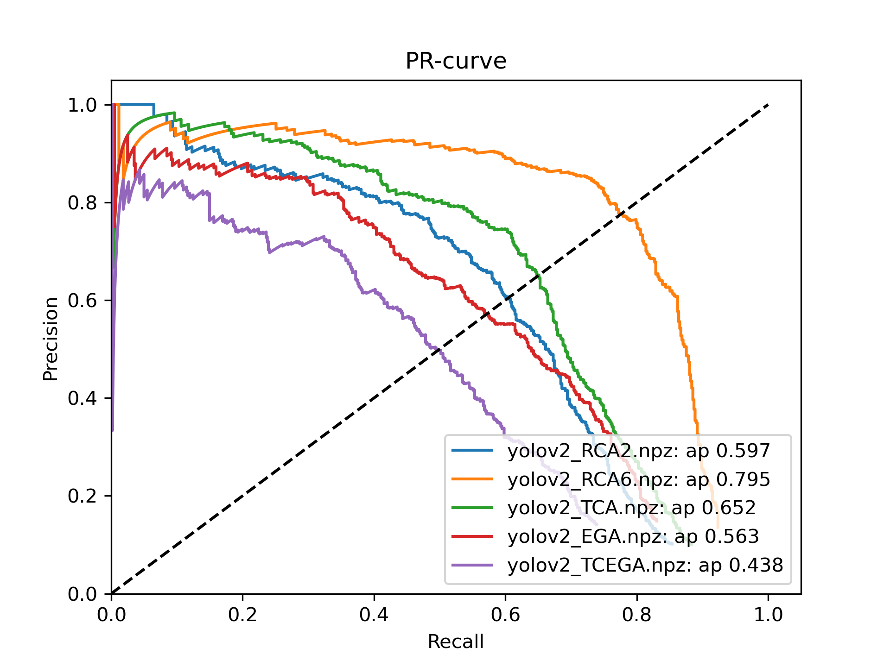

# Adversarial Texture for Fooling Person Detectors in Physical World

Official implementation for the CVPR 2022 paper [Adversarial Texture for Fooling Person Detectors in Physical World](https://arxiv.org/abs/2203.03373)

by Zhanhao Hu, Siyuan Huang, Xiaopei Zhu, Xiaolin Hu, Fuchun Sun, Bo Zhang.

#### 1. Installation
### Requirements
All the codes are tested in the following environment:
* Linux (Ubuntu 18.04.4)
* Python 3.6
* PyTorch 1.7.1
* CUDA 11.0
* TensorboardX 2.2
* EasyDict 1.9

#### 2. Preparation
You need to download the yolov2 and yolov3 weights by
```
wget -P ./data/models/ https://pjreddie.com/media/files/yolov2.weights
wget -P ./data/models/ https://pjreddie.com/media/files/yolov3.weights 
```
and prepare the Inria Dataset
```
curl ftp://ftp.inrialpes.fr/pub/lear/douze/data/INRIAPerson.tar -o inria.tar
tar xf inria.tar
mv INRIAPerson ./data
```
#### 3. Evaluation
We provide the pre-trained parameters of 4 methods for implementing Adversarial Textures (AdvTexture) to attack YOLOv2. Use the following commands to output average precision (AP) for single run. Each command will additionally output a numpy data file and a png format image which are stored in directory "test_results/"
##### RCA
When the side length of the cloth is two times that of the patch
```
python evaluation_texture.py --method RCA --load_path pretrained/RCA2.npy --suffix yolov2_RCA2 --prepare_data
```
When the side length of the cloth is six times that of the patch
```
python evaluation_texture.py --method RCA --load_path pretrained/RCA6.npy --suffix yolov2_RCA6 --prepare_data
```
##### TCA
```
python evaluation_texture.py --method TCA --load_path pretrained/TCA.npy --prepare_data
```
##### EGA
```
python evaluation_texture.py --method EGA --load_path pretrained/EGA.pkl --prepare_data
```
##### TC-EGA
```
python evaluation_texture.py --method TCEGA --load_path pretrained/EGA.pkl --load_path_z pretrained/TCEGA_z.npy --prepare_data
```
##### Plot multiple results together
In addition, we provide a command to plot all the results together. For example, if one run all five evaluations above, then run:
```
python evaluation_texture.py --npz_dir ./test_result
```
It will output a precision v.s. recall curve located at "test_result/PR-curve.png". 

<!-- An instance is shown below:
<p align="center">
  
</p>
 -->
 
#### 4. Train
We provide the command to train for each method.
```
 python training_texture.py --net $NET_NAME --method $METHOD_NAME
```
One need to replace $NET_NAME to "yolov2" or "yolov3" to target different detectors. The $METHOD_NAME can be replaced to "RCA", "TCA", EGA" or "TCEGA" to use different methods. For example, one can use TC-EGA to attack YOLOv2 by
```
 python training_texture.py --net yolov2 --method TCEGA
```
The patterns and checkpoints will be saved in directory "results/".
